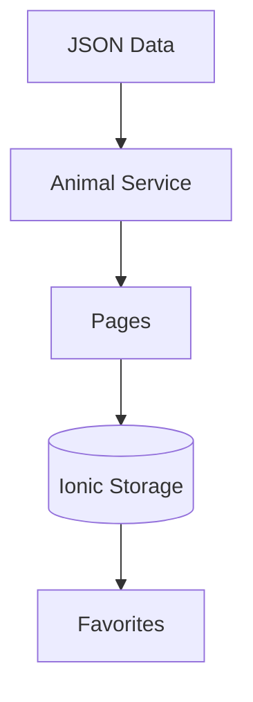

# Animal Shelter PWA

This is a progressive web application (PWA) built using **Ionic + Angular**. A mobile-friendly application for an animal shelter to showcase adoptable pets, manage favorites, and share animal profiles.

## Technology stack used for development

- [x] **Angular** (Standalone components)
- [x] **Ionic Framework**
- [x] **Ionic Native / Capacitor**
- [x] **Ionic Storage**
- [x] **Observable for reading JSON**
- [x] **PWA support** (can be installed as a mobile application)

## Features
- [x] **Animal listings** with photos and details
- [x] **Favorite system** to save preferred animals
- [x] **Sharing functionality** via Capacitor Share plugin
- [x] **Responsive design** works on mobile & desktop
- [x] **Cross-platform** compatibility (iOS/Android/Web)

## Project Structure

| Folder/File       | Description                           |
|-------------------|---------------------------------------|
| **📦src/**           | Main project source directory         |
| ├── **📂app/**       | App configuration                     |
| ├── **📂assets/**    | Static resources                      |
| │   ├── **📂data/**  | JSON data files                       |
| │   ├── **📂js/**    | JavaScript utilities                  |
| ├── **📂components/**| Reusable components                   |
| │   ├── **📂header/**| Custom header component              |
| ├── **📂pages/**     | Application pages                     |
| │   ├── **📂animal-details/**| Animal details page                   |
| │   ├── **📂animal/**  | Animals listing page                  |
| │   ├── **📂contact/**| Contact information                  |
| │   ├── **📂favourites/**  | Favorites page                        |
| │   ├── **📂home/**  | Home screen                           |
| ├── **📂services/**  | Data services                         |
| │   ├── **📜animal.service.ts**| Animal data                   |
| │   ├── **📜fav.service.ts**   | Favorites logic               |
| ├── **📂styles/**    | Global styles                         |
| │   ├── **📜shared.scss**| Shared SCSS variables              |


## Installation
1. Clone the repository
```bash
git clone https://github.com/DmytroKupreiev/shelter-pwa.git
cd shelter-pwa
```
2. Install dependencies
```bash
npm install
```
3. Run the development server
```bash
ionic serve
```

## Deployment

To build for production:
```bash
ionic build
npx cap sync
```
For PWA deployment:
```bash
npm run build -- --configuration=production
```
For native platforms:
```bash
npx cap add android
npx cap add ios
npx cap open android/ios
```

## Data Flow Architecture



## Code Quality

- [x] Strict typing with TypeScript
- [x] Standalone components architecture
- [x] Reactive programming with Observables
- [x] Modular service architecture

## Roadmap

- [x] Add search/filter functionality
- [x] Implement adoption form
- [x] Add push notifications
- [x] Dark mode support
- [x] Multi-language support

## Documentation
For a complete user guide, see [Wiki]().
